<p align="center" id="title_en">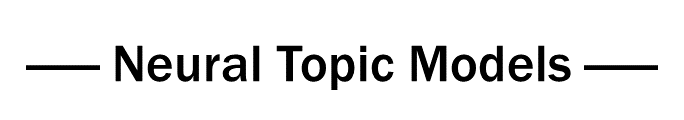</p>

[English](#title_en) | [中文](#title_zh)

[](https://opensource.org/licenses/Apache-2.0)

PyTorch implementations of Neural Topic Model varieties proposed in recent years, including NVDM-GSM, WTM-MMD (W-LDA), WTM-GMM, ETM, BATM ,and GMNTM. The aim of this project is to provide a practical and working example for neural topic models to facilitate the research of related fields. Configuration of the models will not exactly the same as those proposed in the papers, and the hyper-parameters are not carefully finetuned, but I have chosen to get the core ideas covered. 

Empirically, NTM is superior to classical statistical topic models ,especially on short texts. Datasets of short news ([cnews10k](#cnews10k_exp)), dialogue utterances ([zhddline](#zhddline_exp)) and conversation ([zhdd](#zhdd_exp)), are presented for evaluation purpose, all of which are in Chinese. As a comparison to the NTM, an out-of-box LDA script is also provided, which is based on the gensim library. 

Any suggestions or contributions to improving this implementation of NTM are welcomed.

<h2 id="TOC_EN">Table of Contents</h2>

  * [1. Installation](#Installation)
  * [2. Models](#Models)
    + [2.1 NVDM-GSM](#NVDM-GSM)
    + [2.2 WTM-MMD](#WTM-MMD)
    + [2.3 WTM-GMM](#WTM-GMM)
    + [2.4 ETM](#ETM)
    + [2.5 GMNTM](#GMNTM-VaDE)
    + [2.6 BATM](#BATM)
* [3. Datasets](#Datasets)
  * [3.1 cnews10k](#cnews10k_exp)
  * [3.2 zhddline](#zhddline_exp)
  * [3.3 zhdd](#zhdd_exp)
* [4. Usage](#Usage)
  * [4.1 Preparation](#Preparation)
  * [4.2 Run](#Run)
* [5. Acknowledgement](#Acknowledgement)


<h2 id="Installation">1. Installation</h2>

```shell
$ git clone https://github.com/zll17/Neural_Topic_Models
$ cd Neural_Topic_Models/
$ sudo pip install -r requirements.txt
```


<h2 id="Models">2. Models</h2>

<h3 id="NVDM-GSM">2.1 NVDM-GSM</h3>

Original paper: _Discovering Discrete Latent Topics with Neural Variational Inference_

*Author:* Yishu Miao

<p align="center">
    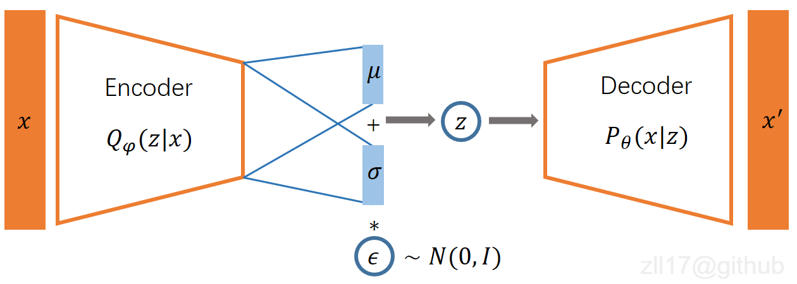
</p>


#### Description
**VAE + Gaussian Softmax**

The architecture of the model is a simple VAE, which takes the BOW of a document as its input. After sampling the latent vector **z** from the variational distribution *Q(z|x)*, the model will normalize **z** through a softmax layer, which will be taken as the topic distribution $ \theta $ in the following steps. Emperically, I found that adding a fully-connected layer before the softmax layer would largely improve the model's performance, therefore, an optional argument **use_fc1** is provided to indicate whether to adopt the affine layer or not. The configuration of the encoder and decoder could also be customized by yourself, depending on your application.

 *Explaination for some arguments:*

​	--taskname: the name of the dataset, on which you want to build the topic model.

​	--n_topic: the number of topics.

​	--num_epochs: number of training epochs.

​	--no_below: to filter out the tokens whose document frequency is below the threshold, should be integer.

​	--no_above: to filter out the tokens whose document frequency is higher than the threshold, set as a float number to indicate the ratio of the number of documents.

​	--use_fc1: adopt an affine layer before the softmax layer when specified.

​	--auto_adj: once adopted, there would be no need to specify the no_above argument, the model will automatically filter out the top 20 words with the highest document frequencies.

​	--bkpt_continue: once adopted, the model will load the last checkpoint file and continue training.


[[Paper](http://proceedings.mlr.press/v70/miao17a.html)]  [[Code](models/GSM.py)]

#### Run Example
```
$ python3 GSM_run.py --taskname cnews10k --n_topic 20 --num_epochs 1000 --no_above 0.0134 --no_below 5 --criterion cross_entropy --use_fc1
```

<p align="center">
    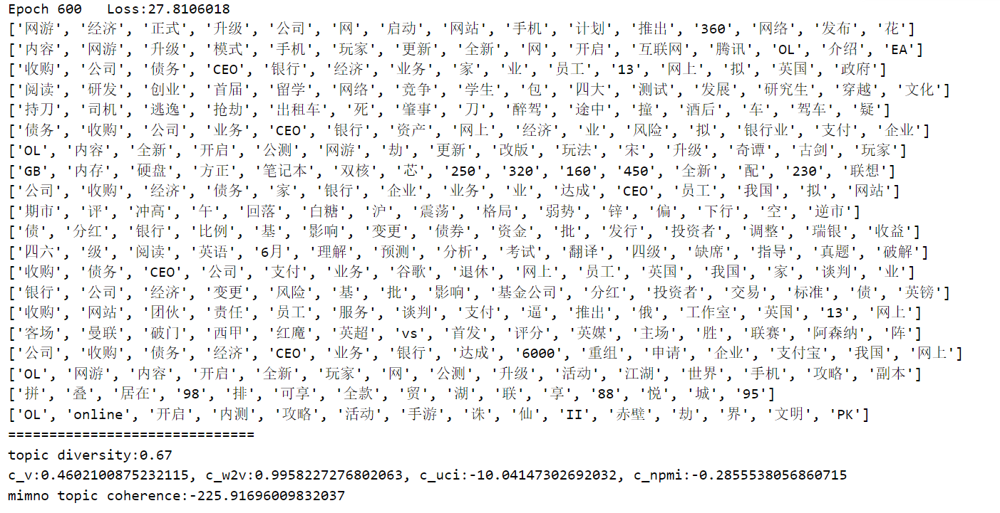
</p>


<h3 id="WTM-MMD">2.2 WTM-MMD</h3>

Original paper: _Topic Modeling with Wasserstein Autoencoders_

*Author:* Feng Nan, Ran Ding, Ramesh Nallapati, Bing Xiang

<p align="center">
    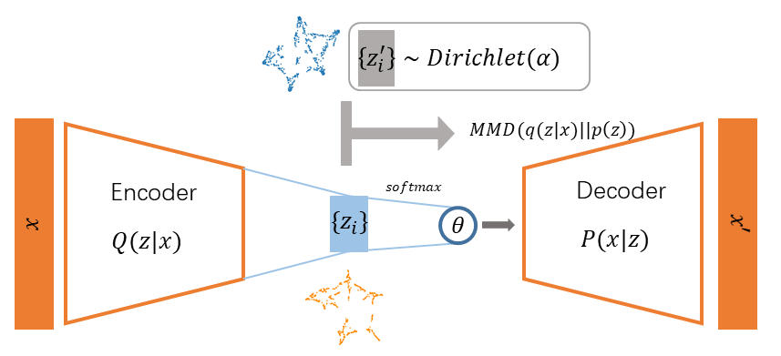
</p>

#### Description
**WAE with Dirichlet prior + Gaussian Softmax**

The architecture is a WAE, which is actually a straightforward AutoEncoder,  with an additional regulation on the latent space. According to the original [paper](https://www.aclweb.org/anthology/P19-1640/), the prior distribution of the latent vectors **z** is set as Dirichlet distribution, while the variational distribution is regulated under the Wasserstein distance. Compared with the GSM model, this model can hugely alleviate the KL collapse problem and obtain more coherent topics.

 *Explaination for some arguments:*

​	--dist: the type of the prior distribution, set as `dirichlet`  to use it as the WLDA model.

​	--alpha: the hyperparameter $\alpha$ in the dirichlet distribution.

The meaning of other arguments can be referred to the [GSM](#NVDM-GSM) model.

[[Paper](https://www.aclweb.org/anthology/P19-1640/)]  [[Code](models/WTM.py)]

#### Run Example
```shell
$ python3 WTM_run.py --taskname cnews10k --n_topic 20 --num_epochs 600 --no_above 0.013 --dist dirichlet
```

<p align="center">
    
</p>


<h3 id="WTM-GMM">2.3 WTM-GMM</h3>

Original paper: _Research on Clustering for Subtitle Dialogue Text Based on Neural Topic Model_

*Author:* Leilan Zhang

<p align="center">
    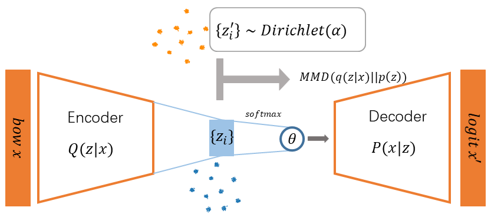
</p>

#### Description

**WAE with Gaussian Mixture prior + Gaussian Softmax**

An improved model of the original WLDA. It takes gaussian mixture distribution as prior distribution, which has two types of evolution strategy: `gmm-std` and `gmm-ctm` (GMM-standart and GMM-customized for short, respectively). The gmm-std adopts Gaussian mixture distribution,  whose components have fixed means and variances, while those of the gmm-ctm will adjust to fit the latent vectors through the whole training process. The number of the components is usually set as the same as the number of topics. Emperically, the WTM-GMM model usually achieve better performance, both in topic coherence and diversity, than WTM-MMD and NVDM-GSM. It also avoid the mode collapse problem, which is a problem plagues the GMNTM for a long time. I personally recommend this model.

*Explaination for some arguments:*

​	--dist: the type of the prior distribution, set as `gmm-std` or `gmm-ctm` to use the corresponding model.

The meaning of other arguments can be referred to the [GSM](#NVDM-GSM) model.

[[Paper](https://under_review)]  [[Code](models/WTM.py)]


#### Run Example
```shell
$ python3 WTM_run.py --taskname zhdd --n_topic 20 --num_epochs 300 --dist gmm-ctm --no_below 5 --auto_adj
```

<p align="center">
    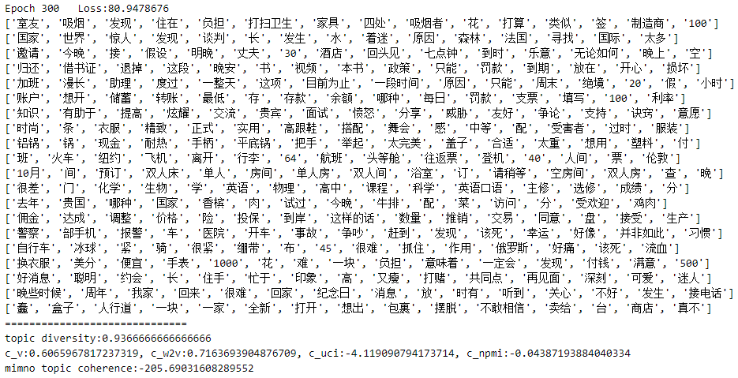
</p>


<h3 id="ETM">2.4 ETM</h3>

Original paper: _Topic Modeling in Embedding Spaces_

*Author:* Adji B. Dieng, Francisco J. R. Ruiz, David M. Blei

<p align="center">
    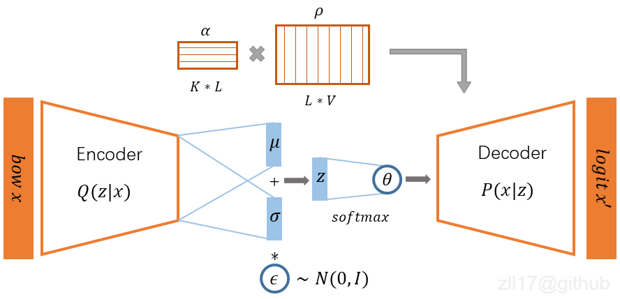
</p>

#### Description

**VAE + Gaussian Softmax + Embedding**

The architecture is a straightforward VAE, with the topic-word distribution matrix decomposed as the product of the topic vectors and the word vectors. The topic vectors and word vectors are jointly trained with the topic modeling process. A note-worthy mentioned advantage of this model is that it can improve the interpretability of topics by locatting the topic vectors and the word vectors in the same space. Correspondingly, the model requires more time to converge to an ideal result than others since it has more parameters to adjust.

 *Explaination for some arguments:*

​	--emb_dim: the dimension of the topic vectors as well as the word vectors, default set as 300.

The meaning of other arguments can be referred to the [GSM](#NVDM-GSM) model.

[[Paper](https://arxiv.org/abs/1907.04907)]  [[Code](models/ETM.py)]

#### Run Example
```shell
$ python3 ETM_run.py --taskname zhdd --n_topic 20 --num_epochs 1000 --no_below 5 --auto_adj --emb_dim 300
```


<h3 id="GMNTM-VaDE">2.5 GMNTM</h3>

Original paper: _Research on Clustering for Subtitle Dialogue Text Based on Neural Topic Model_

*Author:* Leilan Zhang

<p align="center">
    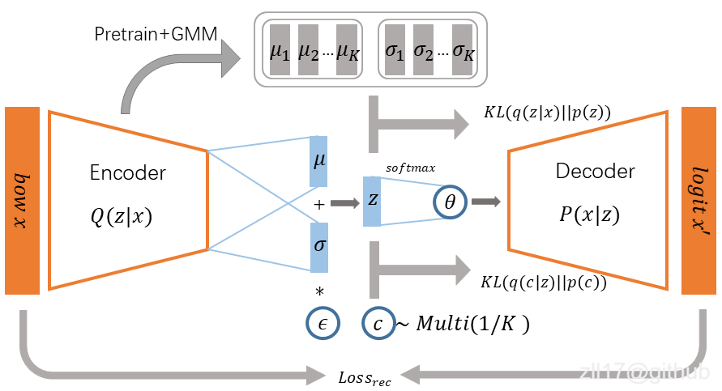
</p>

#### Description
The architecture is based on [VaDE](https://arxiv.org/abs/1611.05148), which takes Gaussian mixture distribution as a prior distribution. Different from the Wasserstein distance adopted by WAE, the VaDE uses KL divergence to measure the discrepancy of prior and variational distribution. It adopts a discrete variable to indicate the belonging component and a continuous variable to indicate the vector in latent space.  The original intent of the GMNTM is to improve the model's representation ability with the import of the multi-mode distribution, to replace the single-mode multivariate Gaussian distribution utilized in GSM. Empirically, it does obtain a series of more diverse and coherent topics than GSM does. However, it suffers from the mode collapse problem, which will finally result in a series of homogeneous topics. Therefore, the training process should not be too long and should be stopped before the collapse occures. 

Any suggestions are welcome.

[[Paper](https://arxiv.org/abs/1611.06430)]  [[Code](implementations/ccgan/ccgan.py)]

#### Run Example
```shell
$ python3 GMNTM_run.py --taskname zhdd --n_topic 20 --num_epochs 300 --no_below 5 --auto_adj
```


<h3 id="BATM">2.6 BATM</h3>

Origianal paper: _Neural Topic Modeling with Bidirectional Adversarial Training_

*Author:* Rui Wang, Xuemeng Hu, Deyu Zhou, Yulan He, Yuxuan Xiong, Chenchen Ye, Haiyang Xu

<p align="center">
    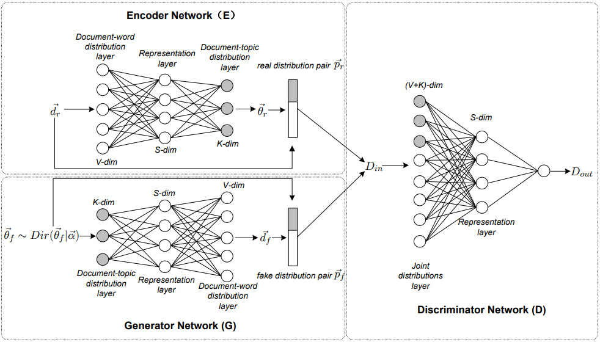
    <div align="center">
    	(The picture is taken from the original <a href="https://arxiv.org/abs/2004.12331">paper</a>.)
	</div>
</p>

#### Description

**GAN+Encoder**

This model is made up of three modules: a Generator, a Discriminator, and an Encoder. The Encoder takes in a real document and outputs its topic distribution vector, concatenated with the normalized BOW of the original document. The Generator will takes in samples from a prior Dirichlet distribution and produce BOW vector of the fake document, concatenated with the sample distribution vectors. The Discriminator maximizes the likelihood of the real distribution pairs and minimizes the likelihood of the fake distribution pairs. Once done the training, the Encoder could output the topic distribution given a document, while the generator could output the topic-word distribution. Althrough it seems like a feasible approach to accomplish the topic modeling task through this adversarial way, my implement of this model cannot work properately. I still work on it and look for solutions. Any ideas or suggestions would be welcome.


[[Paper](https://arxiv.org/abs/2004.12331)]  [[Code](models/BATM.py)]

#### Run Example
```shell
$ python3 BATM_run.py --taskname zhdd --n_topic 20 --num_epochs 300 --no_above 0.039 --no_below 5
```


<h2 id="Datasets">3. Datasets</h2>

- cnews10k: short cnews sampled from the [cnews](http://thuctc.thunlp.org/#%E4%B8%AD%E6%96%87%E6%96%87%E6%9C%AC%E5%88%86%E7%B1%BB%E6%95%B0%E6%8D%AE%E9%9B%86THUCNews) dataset, in Chinese.
- zhddline: a dialogue dataset in Chinese, translated from the [DailyDialog](https://www.aclweb.org/anthology/I17-1099/) dataset by Sogou translation API.
- zhdd:  Every conversation is concatenated  as a document to be processed. There're 12336 documents in total.
- 3body1: The famous science fiction *The Three-Body Problem*, each paragraph is taken as a document.

​	Basic statistics are listed in the following table:

| dataset                             | num of document | genre            | avg len of docs | language |
| ----------------------------------- | --------------- | ---------------- | --------------- | -------- |
| [cnews10k](data/cnews10k_lines.txt) | 10k             | short news       | 18.7            | Chinese  |
| [zhddline](data/zhddline_lines.txt) | 96785           | short utterances | 18.1            | Chinese  |
| [zhdd](data/zhdd_lines.txt)         | 12336           | short dialogues  | 142.1           | Chinese  |
| [3body1](data/3body1_lines.txt)     | 2626            | long novel       | 73.8            | Chinese  |

##### Some snippets

<h6 id="cnews10k_exp">3.1 cnews10k</h6>

<p align="center">
    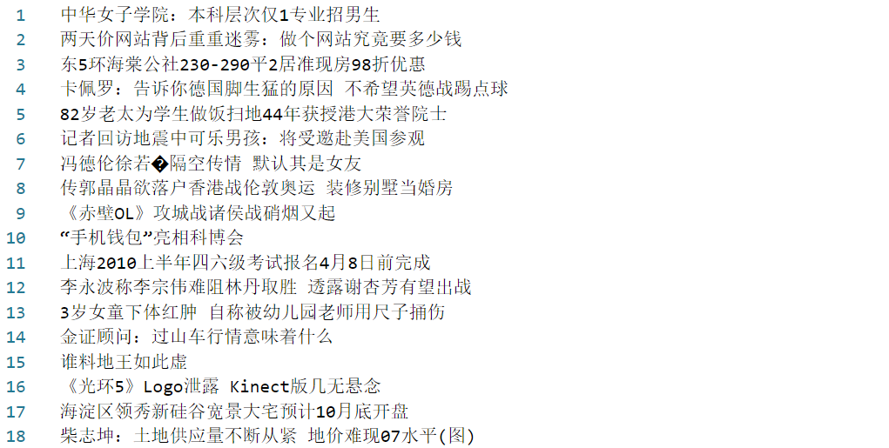
</p>

<h6 id="zhddline_exp">3.2 zhddline</h6>

<p align="center">
    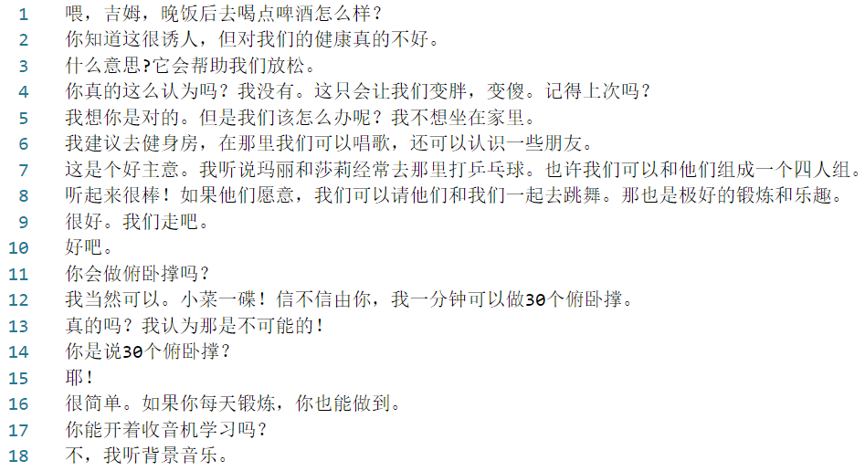
</p>

<h6 id="zhdd_exp">3.3 zhdd</h6>

<p align="center">
    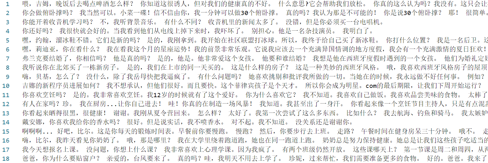
</p>

<h6 id="3body1_exp">3.4 3body1</h6>

<p align="center">
    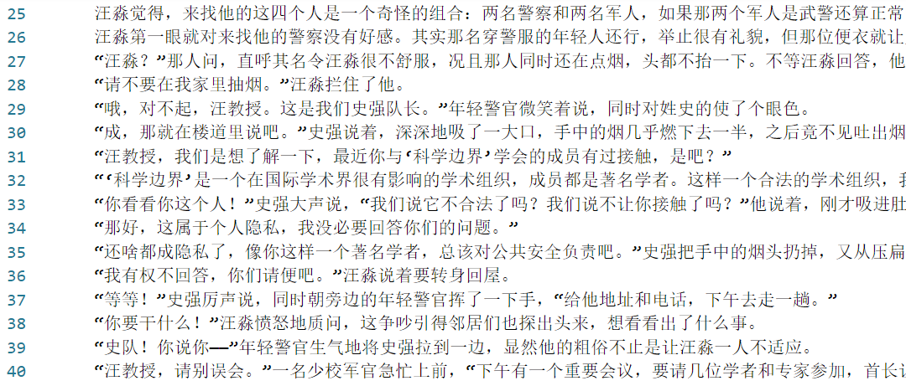
</p>


<h4 id="Usage">4. Usage</h4>

In this section, I will take the zhddline text data as an example and display how to apply the WTM-GMM model on it to modeling its topics. You can use your own text data and follow the same steps.

<h6 id="Preparation">4.1 Preparation</h6>

First, prepare the text data. One line will be taken as one document, so you need to **keep one document in one line**, in our example, each utterance per line. 

<p align="center">
    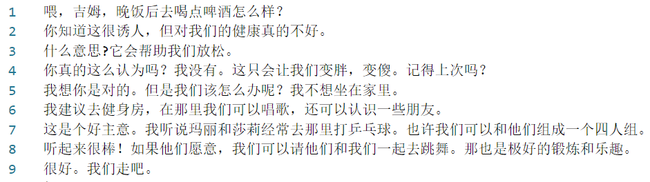
</p>

Then **modify the name of the text file** into the format {taskname}_lines.txt, in this case, `zhddline_lines.txt`. Put the renamed file in the `data` directory.

Finally, **choose the right tokenizer or create one by yourself**. The tokenizer should be customized according to text type. The default configuration utilizes HanLP as tokenizer to deal with modern Chinese sentences. If you need to process other types of text (i.e. in English or in ancient Chinese), open the file `tokenization.py` ,  modify the code in function `Tokenizer` accordingly.

<p align="center">
    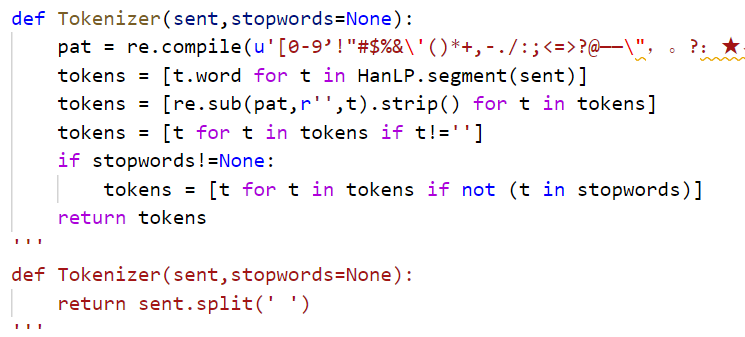
</p>


<h6 id="Run">4.2 Run</h6>

Once done the preparation job, run the corresponding running script, in this case, you need to set the `taskname` as `zhddline` and specify other necessary arguments.

```shell
$ python3 WTM_run.py --taskname zhddline --n_topic 20 --num_epochs 1000 --no_below 5 --dist gmm-std --auto_adj
```

The model will evaluate the topic coherence and topic diversity every 10 epochs, and display the top 20 topic words for each topic. The weight of the model will be stored in the `ckpt` directory once the training is done. The result of the topic modeling is shown below.

<p align="center">
    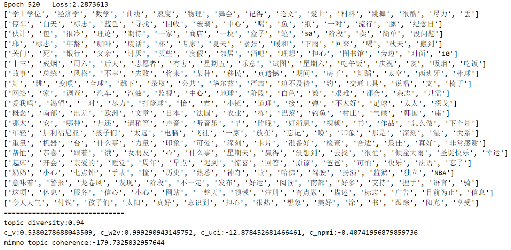
</p>


<h4 id="Acknowledgement">5. Acknowledgement</h4>

I would highly appreciate my supervisor Prof. Qiang Zhou for his valuable inspiration and helpful suggestions to these neural topic models. A big part of this project is supported by him.

In the construction of this project, some implementations are taken as reference, I would like to thank the contributors of those projects: 

- [VaDE](https://github.com/GuHongyang/VaDE-pytorch)
- [WLDA](https://github.com/awslabs/w-lda) 
- [ETM](https://github.com/adjidieng/ETM)

I would also give thanks to @[NekoMt.Tai](https://github.com/xDarkLemon) for her kind shares of her GPU machines with me.

<h4 id="License">License</h4>

Apache License 2.0 

**Cite**: If you find this code useful in your research, please consider citing:

```
@misc{ZLL2020,
  author = {Leilan Zhang, Qiang Zhou},
  title = {Neural Topic Models},
  year = {2020},
  publisher = {GitHub},
  journal = {GitHub repository},
  howpublished = {\url{https://github.com/zll17/Neural_Topic_Models}},
  commit = {f02e8f876449fc3ebffc66f7635a59281b08c1eb}
}
```


-----

<br/><br/><br/><br/><br/><br/><br/><br/><br/><br/><br/><br/><br/><br/><br/><br/><br/><br/><br/><br/><br/><br/><br/><br/><br/><br/><br/><br/>


------------------


<p align="center" id="title_zh"></p>

[English](#title_en) | [中文](#title_zh)

[](https://opensource.org/licenses/Apache-2.0)

若干神经主题模型（Neural Topic Model, NTM）的PyTorch实现，包括NVDM-GSM、WTM-MMD (W-LDA)、WTM-GMM、ETM、 BATM 和 GMNTM。

近年来基于VAE和GAN的神经主题模型的各类变种，相比于经典的统计主题模型（如LDA等），能提取到更一致的主题。NTM在稀疏性十分严重的场景下所提取到的主题，其一致性和多样性都优于LDA，是一种强大（且有意思）的模型。此项目的初衷是提供一组方便、实用的神经主题模型实现，包括部分论文的复现及我自己的改进模型。项目中的模型配置与原论文未必完全一致，但保留了原论文中心思想。

此项目提供有三个中文短文本数据集——新闻标题数据集（[cnews10k](data/cnews10k_lines.txt)）和对话数据集（[zhdd](data/zhdd_lines.txt) 和 [zhddline](data/zhddline_lines.txt)），作评测之用。作为对比，提供了基于gensim编写的LDA脚本，开箱即用，且接口与NTM保持一致。

## 目录

  * [TODO](TODO)
  * [安装](#安装)
  * [模型](模型)
  * [数据集](数据集)
  * [应用示例](应用示例)
  * [致谢](致谢)


## TODO

- <del>训练模型权重保存</del>
- log 曲线绘制
- 文档-主题分布推断
- ETM 主题向量、词向量获取、保存
- 隐空间绘制
- 中文文档完善
- 各个模型性能对比
- 阶段性保存权重，断点续训
2. 高亮推荐模型


## 安装

``` shell
$ git clone https://github.com/zll17/Neural_Topic_Models
$ cd Neural_Topic_Models/
$ sudo pip install -r requirements.txt
```


## 模型

### NVDM-GSM

论文： _Discovering Discrete Latent Topics with Neural Variational Inference_

Author: Yishu Miao

#### Description

VAE + Gaussian Softmax

<p align="center">
    
</p>
（未完待续）
